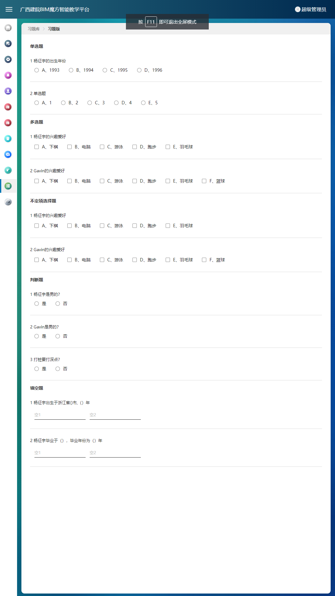
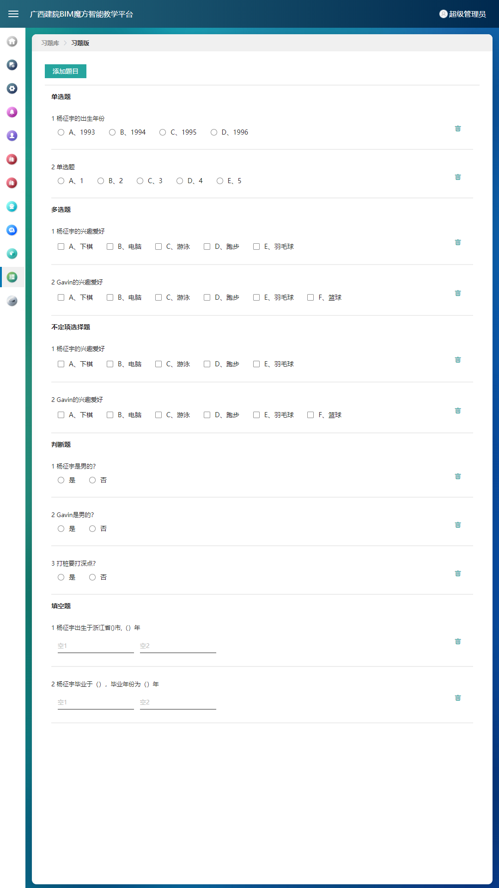
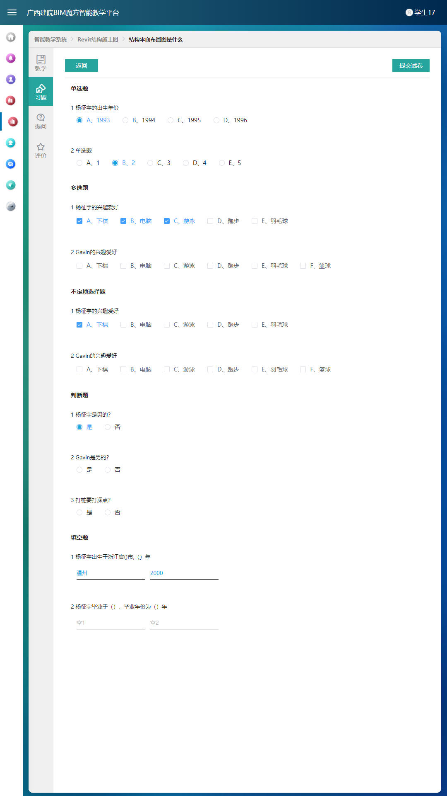
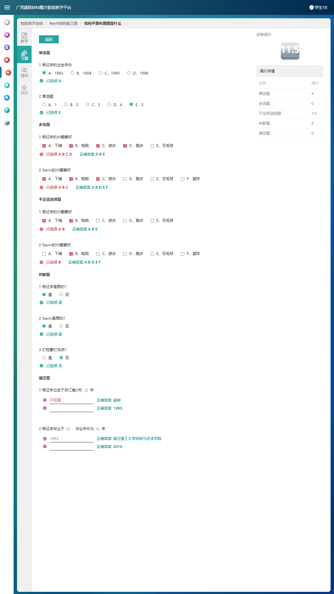

# 前端分享

要想写出令人赏心悦目的代码，我觉得是否使用了合理的设计模式起了至关重要的作用。

## 设计原则与思想

我们不能手里有把锤子，看哪里都是钉子，要知道为什么要使用这种设计模式，以及解决了什么问你题，有哪些应用场景。这才是关键的关键，如果你清晰的明白了这些设计原则，甚至可以根据场景组装你自己的设计模式。

我们应该也大体了解一些比较经典的设计模式，比如 SOLID、KISS、YAGNI、DRY、LOD 等。我们接下来一一进行介绍。


### SOLID 原则
SOLID 原则并非单纯的 1 个原则，而是由 5 个设计原则组成的，它们分别是：单一职责原则、开闭原则、里式替换原则、接口隔离原则和依赖反转原则，依次对应 SOLID 中的 S、O、L、I、D 这 5 个英文字母。我们来分别看一下。

### SRP-单一职责原则
- 全称：Single Responsibility Principle
- 定义：一个类或者模块只负责完成一个职责（或者功能）。
- 理解：每一个类，应该要有明确的定义，不要设计大而全的类，要设计粒度小、功能单一的类。
- 作用：避免将不相关的代码耦合在一起，提高了类或者模块的内聚性。

### OCP-开闭原则
- 全称：Open Closed Principle
- 定义：实体（模块、类、方法等）应该“对扩展开放、对修改关闭”。
- 描述：添加一个新的功能应该是，在已有代码基础上扩展代码（新增模块、类、方法等），而非修改已有代码（修改模块、类、方法等）。
- 作用： 增加了类的可扩展性。

### LSP-接口隔离原则
- 全称：Interface Segregation Principle
- 定义：客户端不应该被强迫依赖它不需要的接口。(其中的“客户端”，可以理解为接口的调用者或者使用者)。
- 描述：使用TyepScript开发的小伙伴可能对Interface更熟悉一些，但是把接口单纯的理解就是Interface也比较片面，我们说的接口可以包括这三个方面：

	1. 一组 API 接口集合
	2. 单个 API 接口或函数
	3. OOP 中的接口概念

这一原则和单一职责原则有点类似，只不过它更侧重于接口。

- 如果把“接口”理解为一组接口集合，可以是某个类库的接口等。如果部分接口只被部分调用者使用，我们就需要将这部分接口隔离出来，单独给这部分调用者使用，而不强迫其他调用者也依赖这部分不会被用到的接口。

- 如果把“接口”理解为单个 API 接口或函数，部分调用者只需要函数中的部分功能，那我们就需要把函数拆分成粒度更细的多个函数，让调用者只依赖它需要的那个细粒度函数。

- 如果把“接口”理解为 OOP 中的接口，也可以理解为面向对象编程语言中的接口语法。那接口的设计要尽量单一，不要让接口的实现类和调用者，依赖不需要的接口函数。

### DIP-依赖反转原则
- 全称：Dependency Inversion Principle
- 定义：高层模块不要依赖低层模块。高层模块和低层模块应该通过抽象来互相依赖。除此之外，抽象不要依赖具体实现细节，具体实现细节依赖抽象。大白话就是面向接口编程，依赖于抽象而不依赖于具体
- 理解：基于接口而非实现编程

### KISS原则
关于KISS原则英文描述有好几个版本

- Keep It Simple and Stupid.
- Keep It Short and Simple.
- Keep It Simple and Straightforward. 

这几个描述的都差不多，大体意思就是： 尽量保持简单。这是一个“万金油”的设计原则，它不光可以用在软件开发上，更加广泛的产品设计，系统设计例如冰箱，洗衣机都用到了这个原则。当时看乔布斯砖的时候，你会觉得他一直在践行这个原则。 那么我们在开发中应该怎么践行这个原则呢

1. 尽量不要使用同事可能不懂的技术来实现代码
2. 不要重复造轮子，要善于使用已经有的工具类库
3. 不要过度优化，不要过度使用一些奇技淫巧


### YAGNI原则

YAGNI 原则的英文全称是：`You Are not Gonna Need It`。直译就是：`你不会需要它`。

这条原则也算是万金油了。当用在软件开发中的时候，它的意思是：`不要去设计当前用不到的功能；不要去编写当前用不到的代码`。实际上，这条原则的核心思想就是：**不要做过度设计**。

### DRY原则

它的英文描述为：`Don’t Repeat Yourself`。中文直译为：`不要重复自己`。

将它应用在编程中，可以理解为：**不要写重复的代码**。 看似简单，实际上我们工作中不自觉的写了大量重复的代码，比如

1. 实现逻辑重复
2. 功能语义重复
3. 代码执行重复

### 迪米特法则

单从这个名字上来看，我们完全猜不出这个原则讲的是什么。不过，它还有另外一个更加达意的名字，叫作`最小知识`原则，英文翻译为：**The Least Knowledge Principle**。 通俗的讲就是：**不该有直接依赖关系的类之间，不要有依赖；有依赖关系的类之间，尽量只依赖必要的接口（也就是定义中的“有限知识”）**。 迪米特法则是实现高内聚，低耦合的法宝。那么什么是高内聚和低耦合呢？

所谓高内聚，就是指相近的功能应该放到同一个类中，不相近的功能不要放到同一个类中。相近的功能往往会被同时修改，放到同一个类中，修改会比较集中，代码容易维护。

所谓低耦合是说，在代码中，类与类之间的依赖关系简单清晰。即使两个类有依赖关系，一个类的代码改动不会或者很少导致依赖类的代码改动。

不该有直接依赖关系的类之间，不要有依赖；有依赖关系的类之间，尽量只依赖必要的接口。迪米特法则是希望减少类之间的耦合，让类越独立越好。每个类都应该少了解系统的其他部分。一旦发生变化，需要了解这一变化的类就会比较少。

## 业务组件封装示例

组件封装基本原则是：`高内聚，低耦合，易读写，可复用`。一般在开发中组件可分为`业务组件`和`公共组件`。

这里举广西建院的习题库功能需求为🌰。广西建院的习题库功能中包含一个`教师可以管理、编辑考试题和查看学生答题结果，学生可以答题并查看答题结果`的这么个需求。
从这个需求中可以分析得出，这是个`试卷组件`,且试卷组件中包含`预览、编辑、答题和答案对比`的功能。抽象一下这些功能，我们可以把以上的功能归类为
`预览模式、编辑模式、答题模式和校对模式`四种模式。那显然我们的试卷组件就有一个`mode`的`props`属性:

```javascript
    //组件模式
    // EXAMINATION_PREVIEW 习题预览模式
    // EXAMINATION_TEST    测试模式
    // EXAMINATION_VERIFY  校验模式
    'mode': {
        type: String,
        required: true,
        default: "EXAMINATION_PREVIEW"
    }            
```

在father组件中调用时就可以根据不同的业务模式传入不同的mode属性值就可以控制试卷组件的业务模式。

```javascript
    <examination
        mode="EXAMINATION_TEST"
    >
    </examination>                    
```

同样的，对于考试卷的具体业务需求和功能实现的必须数据，可相对应的增加其他`props`属性：

```javascript
        props: {
            //只读模式
            'readonly':{
                type: Boolean,
                required: true,
                default: false
            },
            //组件模式的容器高度
            'tableHeight':{
                type: String,
                default: 'calc(100vh - 260px)'
            },
            //试卷id
            'examinationId':{
                type: Number,
                required: true,
                default: 0
            },
            //组件模式
            // EXAMINATION_PREVIEW 习题预览模式
            // EXAMINATION_TEST    测试模式
            // EXAMINATION_VERIFY  校验模式
            'mode':{
                type: String,
                required: true,
                default: "EXAMINATION_PREVIEW"
            },
            //校验模式的源数据
            'verifyData': {
                type: Array,
                default: () => new Array()
            }
        }
```

father组件调用如下：

```javascript
    <!-- 2.学生做题 -->
    <examination
        v-if="componentName === 'doExercise'"
        mode="EXAMINATION_TEST"
        @submit="handleSubmitExamination"
        @navigate-back="navigateBack"
        :examination-id="examinationID"
        :readonly="false">
    </examination>
```

>考试组件的内容其实就是题目，抽象一下就是一个一个的题目组件生成的考试卷，那我们就可以把题目抽象为一个单独的`试题组件`:


```javascript
        props: {
           //题目类型
           'questionType': {
               type: String,
           },
           //题干
           'questionContent':{
               type: String,
           },
           //答案选项
           'answerItems': {
               type: Array,
           },
           //题目的id
           'questionId':{
               type: Number,
               default: 0
           },
           //学生的答案
           'studentAnswer': {
               type: Array,
           },
           //模式
           // EXAMINATION_PREVIEW 习题预览模式
           // EXAMINATION_TEST    测试模式
           // EXAMINATION_VERIFY  校验模式
           'mode': {
               type: String,
               default: 'EXAMINATION_PREVIEW'
           }
       }
```


>我们通过遍历试卷的`configData`来生成整张试卷：


```javascript
        <div :class="readonly ? 'examination__body examination__body--readonly' : 'examination__body'"
             :loading="loading">
            <div class="question__type-container"
                 v-for="(questionTypeData, questionTypeIndex) in questionData">
                <span class="question__type">
                    {{ questionTypeData['Type'] }}
                </span>
                <div :class="mode === 'EXAMINATION_PREVIEW' ? 'question' : 'question question--no-line'"
                     v-for="(questionItem, questionItemIndex) in questionTypeData['Subjects']">
                    <div class="question__body">
                        <examination-question
                            @change="handleAnswerChange"
                            :mode="mode"
                            :question-id="questionItem['ID']"
                            :question-type="questionItem['Type']"
                            :question-content="`${questionItemIndex + 1} ${questionItem['Subject']}`"
                            :student-answer="questionItem['StudentAnswer'] || []"
                            :answer-items="questionItem['Answers']">
                        </examination-question>
                    </div>
                    <div class="question__operation">
                        <i title="删除"
                           v-if="!readonly && mode !== 'EXAMINATION_TEST'"
                           @click="handleRemoveQuestion(questionItem)"
                           class="iconfont iconfont-in-table">
                            &#xe62c;
                        </i>
                    </div>
                </div>
            </div>
        </div>
```

于是，我们就可以通过以上的方式得到满足功能需求的一个试卷组件。

>预览模式



>编辑模式



>考试模式



>校验模式


