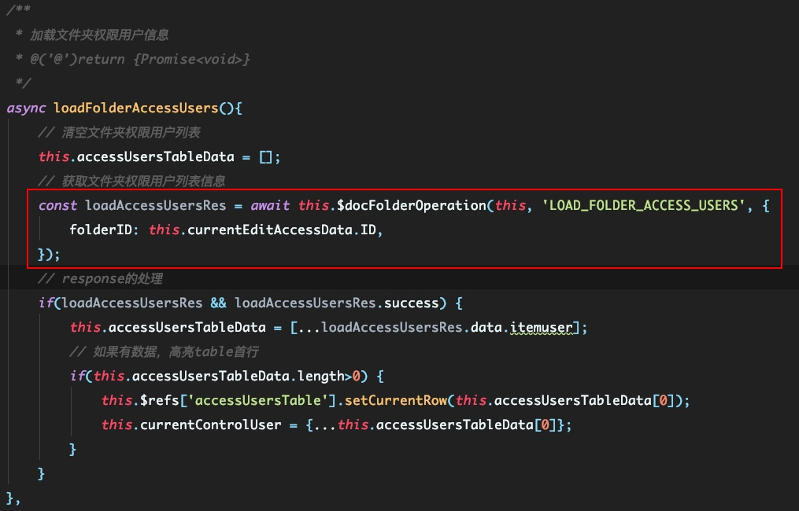
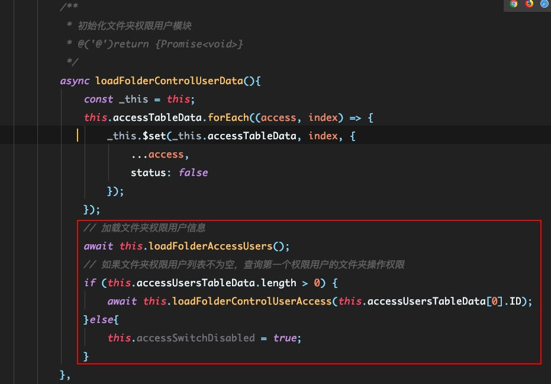
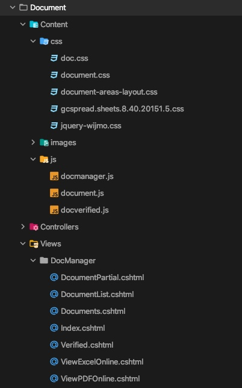

# 前端菜鸟技术分享 

**目录**

- Git常用命令行及个人使用经验
- JavaScript个人使用经验
- 关于前端技术栈的讨论


## Git常用命令行及个人使用经验

>Git常用命令，扒了一张腾讯前端团队的思维导图，拿去参考


>个人使用经验

**正常merge的几种形式**

- 普通的merge
- rebase merge
- squash merge

### 1. 普通的merge


```javascript
 git add .
 git commit -m 'commit code'
 git checkout master 
 git merge dev
```

>普通的直接使用git merge ，会保留历史提交记录，及保存并显示git commit树状结构。当分支之间不存在分歧的情况下,这种方式不会因为合并而产生冲突，Git在这种情况下会进行fast-forward(--ff)。

***合并前：***

```javascript
 A-B (master)
   |
   C-D-E (dev)
```

***合并后：***

```javascript
 A-B-C-D-E (master)
   |
   C-D-E (dev)
```


>但如果分之间有分歧的情况下，在git merge的过程中,会把从分歧开始的所有commit合并成一体,并将这个临时的commit去和master进行比较.如果产生冲突的话则会把冲突在一个新的commit里面一次性解决掉,并且把这个新的commit贴在master末尾。(--no-ff)

***合并前：***

```javascript
 A-B-C (master)
   |
   D-E-F (dev)
```

***合并后：***

```javascript
 A-B-C-G (master)
   |   |
   D-E-F (dev)
```

### 2. rebase merge

```javascript
git add .
git commit -m 'commit message'
git rebase master
git checkout master
git merge dev

```

>rebase处理分支合并的方式类似把开发分支的commit change一个一个应用到master分支。可以想象成你在master分支上完成了所有的这些commit。这个过程中,每一个commit都有可能产生冲突,而每一个冲突都要一次一次解决。冲突解决以后,每一个修改过的commit直接会跟在master之后。简单来说就是，rebase的commit一直在最新的结点。

***合并前：***

```javascript
 A-B-C (master)
   |
   D-E-F (dev)
```

***合并后：***

```javascript
 A-B-C-D*-E*-F* (master)
   |
   D-E-F (dev)
```

### 3. squash merge

```javascript
 git add .
 git commit -m 'commit message'
 
 ...多次commit操作
 
 git checkout master
 git merge --squash dev
 git add .
 git commit -m 'new commit on master'
 
```

>svn的在合并分支时采用的就是这种方式，squash会在当前分支新建一个提交节点。squash和no-ff非常类似，区别只有一点不会保留对合入分支的引用。

***合并前：***

```javascript
 A-B (master)
   |
   C-D-E (dev)
```

***合并后：***

```javascript
 A-B-----F* (master)
   |
   C-D-E (dev)
```

## JavaScript个人使用经验

>个人日常“搬砖”过程中总结的一些小方法

### 1. 异步请求的同步写法

>在日常“搬砖”中，异步请求操作可以说是家常便饭了。但在实际开发中，难免会遇到一些小问题。比如，如何控制多异步请求的串行问题？

目前项目中，异步请求多使用的是jQuery封装的Ajax方法，使用起来简单粗暴，但在处理多异步请求串行问题上，最简单的做法就是将下一个请求写在上一个请求的回调中。这样，虽然可以解决这个问题，但是一旦请求数量过多，难免会出现“回调地狱”的状况。

结合过去的开发经验，以及各种资料的学习。我使用`axios`（一个基于 Promise 的 HTTP 库）、`try/catch`和`async/await`封装了一个异步请求处理方法。

>拿文档管理的代码举个🌰 （代码已简化）。


```javascript
/**
 * 文档管理公共方法 - 文件夹操作
 * @param vm {object} vue实例
 * @param operateType {string} 文件夹操作类型
 * @param options {object} 请求参数
 * @return {Promise<{data: {}, success: boolean}>}
 */
const docFolderOperation = async (vm, operateType, options = {}) => {

	//文件夹操作请求配置项
    const OPTIONS = {
    	 ...
    	 //获取文件夹权限用户信息
        'LOAD_FOLDER_ACCESS_USERS': {
            requestOptions: {
                url: DOCUMENT_MANAGEMENT_API.loadFolderAccessUsers,
                params: {...options},
                method: 'get'
            },
            responseOptions: {
                successMsg: '',
                errorMsg: '获取文件夹权限用户失败'
            }
        },
        ...
       
    };
	 
	 //返回的数据结构
    let response = {};

    try {
        //请求
        const res = await vm.$http(OPTIONS[operateType].requestOptions);
        //处理请求
        if (res && res.hasOwnProperty('ResultData')) {
            response = {
                success: true,
                data: {...res.ResultData}
            };
            if(OPTIONS[operateType].responseOptions.successMsg !== ''){
                $.promptview.send(OPTIONS[operateType].responseOptions.successMsg, 'success');
            }
        }
    } catch (e) {
        response = {
            success: false,
            data: {}
        };
        reject(e, OPTIONS[operateType].responseOptions.errorMsg);
    }

    return response;
};

```
>在工程资料中获取文件夹权限用户信息时的使用



>在多异步操作时的使用（需要串行时）



以上，这样既可以实现多异步串行，也可以避免“回调地狱”的问题。


## 关于前端技术栈的讨论

>讨论一下目前公司主流的与我个人比较擅长的前端技术栈，还有关于为什么我要进行代码重构的问题。

### 前端技术栈的讨论

>目前公司主流的前端技术栈为`jQuery``Bootstrap`

`jQuery`的特点：

1. __强大的选择器__. 
	
	`jQuery`允许开发者使用从CSS1到CSS3几乎所有的选择器，以及`jQuery`独创的高级而且复杂的选择器.
2. __出色的DOM操作的封装__. 
	
	`jQuery`封装了大量常用的`DOM`操作，使开发者在编写`DOM`操作相关程序的时候能够得心应手.
3. __完善的Ajax__. 
	
	`jQuery`将所有的Ajax操作封装到一个函数`$.ajax()`里，使得开发者处理Ajax的时候能够专心处理业务逻辑而无需关心复杂的浏览器兼容性和`XMLHttpRequest`对象的创建和使用的问题.
4. __链式操作方式__. 
	
	`jQuery`的链式操作方式，即对发生在同一个`jQuery`对象上的一组动作，可以直接接连写无需要重复获取对象.
5. __开源免费__.

`Bootstrap`的特点:

1. __响应布局__.
	
	`Bootstrap`提供了一套响应式、移动设备优先的流式栅格系统。它可以根据用户屏幕尺寸调整页面，使其在各个尺寸上都表现良好
2. __CSS模块化__.
	
	`Bootstrap`预先定义了很多CSS类，使用的时候直接给`class`赋予对应的类名即可，如`text-left`、`text-align`、`.table`等
3. __内置JavaScript插件__.
	
	`Bootstrap`提供了很多实用性的`jQuery`插件，这些插件方便开发者实现WEB中各种常规特效。所以`Bootstrap`依赖于`jQuery`
4. __丰富的组件__.
	
	`Bootstrap`提供了实用性很强的组件，包括：导航，标签，工具条，按钮等供开发者使用.

>个人擅长的前端技术栈`ES6+``Vue.js`

`ES6+`的特点

- __面向未来编程__

`Vue.js`框架的特点:

1. __轻量级框架__.

	只关注视图层,是一个构建数据的视图集合.
2. __上手容易__.
	
	国人开发,中文文档,不存在语言障碍,易于理解和学习
3. __双向数据绑定__.
4. __虚拟DOM__.
	
	不再需要手动去操作 DOM，只需要写好 View-Model 的代码逻辑，框架会根据虚拟 DOM 和 数据双向绑定，帮我们以可预期的方式更新视图，极大提高我们的开发效率
5. __组件化__. 
	
	实现了html的封装和重用,在构建单页面应用方面有着独特的优势
6. __视图,数据,结构分离__.
	
	数据的更改更为简单,不需要进行逻辑代码的修改,只需要操作数据就能完成相关操作


>使用传统的`jQuery`与使用`Vue.js`开发比较，实际上是一种开发思维上的比较

1. __`jQuery`是一个库，`Vue`是个框架__

	`jQuery`只是将原生代码封装成一个库，而`Vue`的实现比`jQuery`复杂的多，而且`Vue`是框架，除了行为，还需要负责内容和样式。

2. __`jQuery`是事件驱动，`Vue`是数据驱动__

	很多时候，使用`jQuery`的代码就是给元素绑定一堆事件，就OK了。但是`Vue`是以数据变化为驱动，你的主要工作是改变数据。

3. __`jQuery`是程序员主要操作`DOM`，`Vue`是避免程序员操作DOM__

	`jQuery`经常干的事情是把`DOM`的元素改来改去，变来变去，但是`Vue`的原则是最小化修改`DOM`，尽量只修改数据，`Vue`自己负责修改`DOM`。

4. __`jQuery`没有组件的概念，`Vue`的核心之一是组件__

	`jQuery`认为它可以操纵全页面，所以任何一段html代码和一段css代码都不可能只属于某一段jQuery代码。而`Vue`则有组件的概念，一个组件文件，通常是一个`.vue`文件内，会有一段js，一段html，以及一段css。

5. __`jQuery`的大部分代码只是原生JavaScript的封装，`Vue`则复杂得多__

	`jQuery`的大部分代码，比如选择器，比如`.show()`、`.hide()`、`$.ajax()`等等，有时候`jQuery`一行能搞定的，原生JS三四行也能搞定，所以`jQuery`主要是封装的作用。而`Vue`就不会让你这么简单的几行代码就搞定，因为`Vue`不是原生JS的行为封装。所以如果只是比较两者实现弹出`alert('OK')`谁的代码更简单，当然是`jQuery`。

6. __`jQuery`是非响应式的，`Vue`是响应式的__

	比如一个外卖页面，用户将一个商品加入购物车，那么，页面下方的总价位置，就要做对应的计算。如果是用`jQuery`，你就需要去监听用户的点击“加号”的操作，然后去修改页面下方显示的总价。然后根据配送费的不同，总价又会变来变去，你就要给用户的N种可能操作都要分别绑上事件，事件中都要处理页面最下方的总价的显示。然而，如果是用`Vue`，你不用关心有哪些位置显示总价，也不用关心哪些事件会影响总价，你只需要修改总价数据就可以了，所有显示总价的地方会自动更新。

	`Vue`之中还有一个强大的功能就是`watch`，也就是监听数据变化。如果十个操作都会影响总价，而计算出总价之后又需要计算出折扣，如果用`jQuery`的话，你需要将十个事件的处理函数的末尾，都加上计算折扣的函数。如果用`Vue`，一个监听就可以搞定，只需要监听总价是否有变化，每次有变化就计算一次折扣，所以，每个用户事件中不再有任何关于折扣的代码，即使将来又多了十个用户事件，也没有区别。

7. __`jQuery`适合于交互简单的页面，`Vue`适合于交互复杂的页面__

	`jQuery`擅长的方面是，行为和结果有一对一的关联，强调的是用户事件，比如用户点击赞，旁边的赞数就加1，除此之外没有别的。`Vue`擅长的是行为和结果多对多的关联，强调的是数据关联和响应，比如用户在外卖页面里点了一个菜，那么，购物车列表会计算一遍，总价会计算一遍，配送费会计算一遍，是否达到起送标准会计算一遍，是否达到某个代金券的适用范围会计算一遍，等等等等，当用户在外卖页面里把一个菜又追加了一份（点了一次加号），或者又减掉了一份（点了一次减号），又会引起一系列的计算，这时候如果用`jQuery`，你需要为每一个计算都定义1个函数，最终定义N个函数，然后每1个函数可能都需要其他函数提供计算结果，而每个事件又可能调用多个函数，最终你会有一种要疯的感觉。


### 关于代码重构

>还是拿`文档管理`功能举🌰

	
- __目前代码不好的地方__
	
	1. __代码混乱__
	
		现在`文档管理`的功能主要运用在`设计图纸`、`设计模型`、`施工图纸`、`施工模型`和`工程资料`五个模块。虽然是一样的功能，但是`工程资料`是初版代码，其余四个模块是一构代码。代码实现的风格、写法、结构不统一，比较混杂。
		
		
		>初版代码结构
		
		
	2. __缺少注释及相关文档说明__
		
		虽然能够独立地读懂代码的含义是一个程序员的基本素养，但是面对 __初版__ 的文档管理代码，几乎没有注释的变量、方法和调用逻辑，可能我本人水平有限，确实难以维护。
		
		
	3. __大量的DOM操作，难以维护__
	
		使用`jQuery`进行大量的DOM操作，容易引发的问题就是，一旦HTML结构改变，需要更改的js逻辑部分也要一并修改，对于 __出版__ 代码来说，在缺少文档说明以及本身对代码的熟悉程度不够的情况下，很容易出现只是改了一处结构，很多地方都不对了的情况,难以维护。
		
		
- __重构方式__

	参考上一节`前端技术栈的讨论`的对比情况，再加上我以往的项目开发经验，最后我决定使用`Vue`对该功能进行重构。

- __重构的预期结果__

	1. 文档管理代码的结构、样式、行为统一
	2. 抽离出文档管理功能的公共方法，提高了代码的可复用性
	3. 功能基于`Vue`实现，数据驱动视图层的改变，代码维护只需要关注数据的变化，逻辑代码几乎不进行DOM操作
	4. 由于减少了大量的DOM操作，代码量减少，代码体积缩小
	5. 所有重构代码补充了相关的注释和说明，便于以后他人维护
	6. 使用大厂的开源组件库，UI的样式效果提升。


