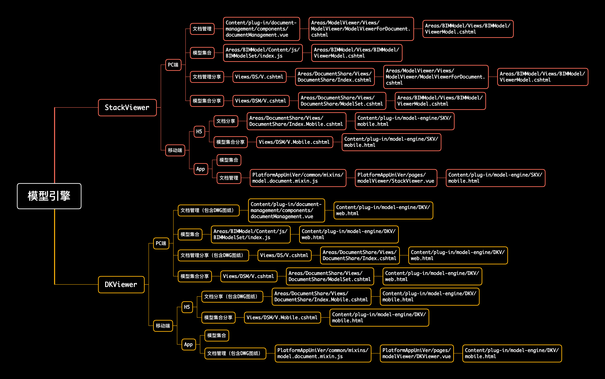
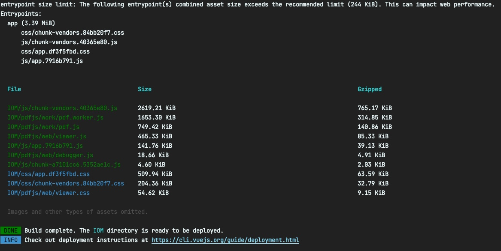

# 年终总结

## 研发数据概览
在过去的2020年中，我主要参与了`αBIM项目管控平台-中建国际`、`αBIM项目管控平台-App端`、`广西建院智能教学平台`、`IOM（web）`几个项目的研发工作。

> 以下数据来自git仓库的记录查询

```git
#统计提交数量
git log --author=Gavin --since="2020-01-01" --no-merges | grep -e 'commit [a-zA-Z0-9]*' | wc -l
#统计提交变更总量
git log --author="Gavin" --pretty=tformat: --numstat | awk '{ add += $1; subs += $2; loc += $1 - $2 } END { printf "added lines: %s, removed lines: %s, total lines: %s\n", add, subs, loc }' -
```


代码提交数据概览:

| 项目  | 提交数 | added lines | removed lines | total lines |
| :------------- | :-------------: | :-------------: | :-------------: | :-------------: |
| IOM  | 88  |  133194  |  22548 |  110646 |
| αBIM项目管控平台-中建国际  | 229  | 1268164 | 192877 | 1075287  |
| αBIM项目管控平台-App端  | 67  |  33522 | 16240 | 16240  |
| 广西建院智能教学平台  | 371  |  1917228 | 1686148 | 231080  |

## 项目贡献

### 1. 模型引擎封装与应用
我在平台应用中封装了两大模型引擎，基于`Autodesk Forge`研发的`DKViewer`模型引擎和另一个原平台的`StackViewer`模型引擎。在第一版本中，统一封装了模型引擎的使用方式，统一了整个`AlphaBIM`平台产品关于模型的应用。


### 2. 前端工程化的应用
在`IOM(web)`项目的研发中，创新地使用`前端工程化`的思想，使用`Vue.js脚手架(Vue-cil)`搭建项目的前端部分，采用`前后端分离`的思想，将前端完全从公司原有的`MVC`架构中剥离出来，使前端研发可以跨终端研发，解除研发必要的运行环境限制，前后端直接直接通过接口约定进行交互，不产生任何其他的物理上的联系，大大的降低代码维护量。
使用`前端工程化`，使前端开发可以使用最先进的前端技术包括但不限于`webpack`、`glup`、`CSS预处理器`、`npm包管理`、`yarn包管理`	、`自动化构建打包和部署`功能,可以基于`MVVM`进行开发工作，组件化开发，极大的提高前端研发人员的开发效率。


### 3. 基于axios的前后端通信方法
我在研发的过程中，基于`axios`，二次封装了前后端的交互通信方法`request.js`，在`axios`原有的功能基础上，将`axios`Promise化、写法同步化。可以使开发人员以正常同步的语句写法调用异步方法，极大的提升了开发效率；此外，我还对该方法添加拦截器监听，实现了同时多次调用同名接口，可以`cancel`先前的请求，只保留最后一次请求，提升性能。目前此方法已在各个平台项目中投入使用:

```javascript
import axios from 'axios'

/**
 * 创建axios实例
 */
const instance = axios.create({
	// `url` 是用于请求的服务器 URL
	url: '',
	// `method` 是创建请求时使用的方法
	// 默认是 get
	method: 'get',
	// `baseURL` 将自动加在 `url` 前面，除非 `url` 是一个绝对 URL。
	// 它可以通过设置一个 `baseURL` 便于为 axios 实例的方法传递相对 URL
	baseURL: `${window.location.origin}/`,
	// `params` 是即将与请求一起发送的 URL 参数
	// 必须是一个无格式对象(plain object)或 URLSearchParams 对象
	params: {},
	// `data` 是作为请求主体被发送的数据
	// 只适用于这些请求方法 'PUT', 'POST', 和 'PATCH'
	// 在没有设置 `transformRequest` 时，必须是以下类型之一：
	// - string, plain object, ArrayBuffer, ArrayBufferView, URLSearchParams
	// - 浏览器专属：FormData, File, Blob
	// - Node 专属： Stream
	data: {},
	// `timeout` 指定请求超时的毫秒数(0 表示无超时时间)
	// 如果请求时长超过 `timeout` 的时间，请求将被中断
	timeout: 0,
});

let pendingQueue = new Map()
const CancelToken = axios.CancelToken

/**
 * 判断请求是否在队列中，如果在就对队列中的该请求执行取消操作
 * @param config
 */
const judgePendingFunc = function (config) {
	if (pendingQueue.has(`${config.method}->${config.url}`)) {
		pendingQueue.get(`${config.method}->${config.url}`)()
	}
}
/**
 * 删除队列中对应已执行的请求
 * @param config
 */
const removeResolvedFunc = function (config) {
	if (pendingQueue.has(`${config.method}->${config.url}`)) {
		pendingQueue.delete(`${config.method}->${config.url}`)
	}
}


// 设置request拦截器
instance.interceptors.request.use(
	config => {
		// Do something before request is sent
		// 请求发起之前先检验该请求是否在队列中，如果在就把队列中pending的请求cancel掉
		judgePendingFunc(config)
		// 将pending队列中的请求设置为当前
		config.cancelToken = new CancelToken(cb => {
			pendingQueue.set(`${config.method}->${config.url}`, cb)
		})
		return config
	},
	error => {
		// 请求错误时的回调逻辑
		return Promise.reject(error);
	}
);

// 设置response 拦截器
instance.interceptors.response.use(
	response => {
		const {
			data,
			status
		} = response;
		
		removeResolvedFunc(response.config)
		
		const codeReg = /^20\d+/; //HTTP状态码 200 ~
		if (! codeReg.test(status.toString())) {
			return Promise.reject('error');
		} else {
			return data
		}
	},
	error => {
		return Promise.reject(error)
	}
);

/**
 * 请求方法
 * @param options {object} 请求参数对象
 * @return {Promise<{data: {[p: string]: *}, success: boolean}>}
 */
const request = async options => {
	let {
		url,
		method,
		params,
		data,
		headers,
	} = options;
	
	url = url || '';
	url = url.includes('http')
		? url
		: 'http://47.110.15.13:9056' + url;
	method = method || 'get';
	params = params || {};
	data = data || {};
	
	let response = {};
	
	try {
		let res = await instance({
			url,
			method,
			params,
			data,
			headers,
			timeout: 0
		});
		response = {
			success: true,
			data: res['ResultData'] || res,
			message: ! res['HasMessage']
				? res['MessageModel']
				: null
		};
	}
	catch (err) {
		response = {
			data: {
				...err
			},
			success: false
		}
	}
	return response;
};


export { request }
```
> request.js的应用

```javascript
   /**
     * 获取二级发布自动勾选的id组
     * @returns {Promise<void>}
     */
    async queryProjectAreaGroup() {
      const {success, data} = await this.$http({
        url: this.$api.queryProjectAreaGroup,
        params: {
          areaID: this.areaID
        }
      })
      if (success) {
        let ids = []
        for (let item of data.values()) {
          ids.push(item.ID)
        }
        this.secondaryReleaseCheckedHandler(ids)
      }
    }
```

## 计划
过去2020年的年中计划完成情况：
- [x] Git仓库管理的方案进一步优化与实施
- [ ] αBIM平台项目前端的完全抽离和技术栈迁移

未来的计划：
- [ ] αBIM平台项目前端的完全抽离和技术栈迁移
- [ ] 好好整理需求，好好分析理解业务，代码保质保量
