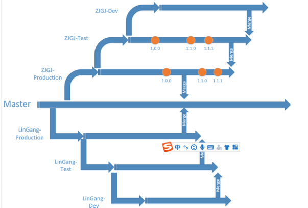
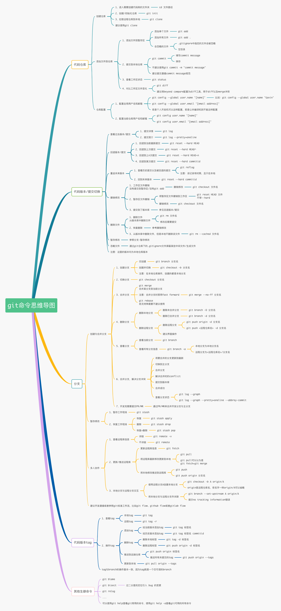

# 2020年年中总结

**目录**

- 工作总结
- 工作中的问题
- 未来的计划

## 一、工作总结

>代码贡献

**上半年主要参与了4个大项目的开发：`αBIM项目管控平台-临港`、`αBIM项目管控平台-中建国际`、`αBIM项目管控平台-App端`和`广西建院智能教学平台`**

**代码提交量统计：**
- `αBIM项目管控平台-临港`: 559次提交
- `αBIM项目管控平台-中建国际`: 555次提交
- `αBIM项目管控平台-App端`: 26次提交
- `广西建院智能教学平台`: 319次提交

>工作总结

作为一名程序员，代码保质保量是理所应当的，因此以下不总结coding相关问题。除此之外，总结了一下在这几个月的工作中，几个主要方向上的内容：

- 业务：通过几个项目的业务开发，了解了一些BIM行业的知识，了解了一些BIM平台开发面向的群体的一些业务问题。

- 技术：经过平台的几个项目开发的不断尝试，在原有的前端技术体系上引入了新的技术`Vue.js`和新的组件库`Element-UI`，在一定程度上提高了前端团队的开发效率。
个人优化、封装并维护了一些公共组件（`文档管理`、`组合表单组件`、`工具函数`等）。

- 管理：基于`Git`代码仓库，提出并实施了依据`分支(branch)`来管理同项目下面向不同定制化开发的的代码管理解决方案。

####技术总结：

在原有的前端技术体系上引入了新的技术`Vue.js`和新的组件库`Element-UI`。过去公司主流的前端技术栈为`jQuery`、`Bootstrap`，其特点为：
1. __强大的选择器__. 
	`jQuery`允许开发者使用从CSS1到CSS3几乎所有的选择器，以及`jQuery`独创的高级而且复杂的选择器.
2. __出色的DOM操作的封装__. 
	`jQuery`封装了大量常用的`DOM`操作，使开发者在编写`DOM`操作相关程序的时候能够得心应手.
3. __完善的Ajax__. 
	`jQuery`将所有的Ajax操作封装到一个函数`$.ajax()`里，使得开发者处理Ajax的时候能够专心处理业务逻辑而无需关心复杂的浏览器兼容性和`XMLHttpRequest`对象的创建和使用的问题.
4. __链式操作方式__. 
	`jQuery`的链式操作方式，即对发生在同一个`jQuery`对象上的一组动作，可以直接接连写无需要重复获取对象.
5. __开源免费__.
6. __响应布局__.
	`Bootstrap`提供了一套响应式、移动设备优先的流式栅格系统。它可以根据用户屏幕尺寸调整页面，使其在各个尺寸上都表现良好
7. __CSS模块化__.
	`Bootstrap`预先定义了很多CSS类，使用的时候直接给`class`赋予对应的类名即可，如`text-left`、`text-align`、`.table`等
8. __内置JavaScript插件__.
	`Bootstrap`提供了很多实用性的`jQuery`插件，这些插件方便开发者实现WEB中各种常规特效。所以`Bootstrap`依赖于`jQuery`
9. __丰富的组件__.
	`Bootstrap`提供了实用性很强的组件，包括：导航，标签，工具条，按钮等供开发者使用.

而相比之下，使用`ES6+`、`Vue.js`的优势
1. __轻量级框架__.
	只关注视图层,是一个构建数据的视图集合.
2. __上手容易__.
	国人开发,中文文档,不存在语言障碍,易于理解和学习
3. __双向数据绑定__.
4. __虚拟DOM__.
	不再需要手动去操作 DOM，只需要写好 View-Model 的代码逻辑，框架会根据虚拟 DOM 和 数据双向绑定，帮我们以可预期的方式更新视图，极大提高我们的开发效率
5. __组件化__. 
	实现了html的封装和重用,在构建单页面应用方面有着独特的优势
6. __视图,数据,结构分离__.
	数据的更改更为简单,不需要进行逻辑代码的修改,只需要操作数据就能完成相关操作

使用传统的`jQuery`与使用`Vue.js`开发比较，实际上是一种开发思维上的比较。

1. __`jQuery`是一个库，`Vue`是个框架__
	`jQuery`只是将原生代码封装成一个库，而`Vue`的实现比`jQuery`复杂的多，而且`Vue`是框架，除了行为，还需要负责内容和样式。

2. __`jQuery`是事件驱动，`Vue`是数据驱动__
	很多时候，使用`jQuery`的代码就是给元素绑定一堆事件，就OK了。但是`Vue`是以数据变化为驱动，你的主要工作是改变数据。

3. __`jQuery`是程序员主要操作`DOM`，`Vue`是避免程序员操作DOM__
	`jQuery`经常干的事情是把`DOM`的元素改来改去，变来变去，但是`Vue`的原则是最小化修改`DOM`，尽量只修改数据，`Vue`自己负责修改`DOM`。

4. __`jQuery`没有组件的概念，`Vue`的核心之一是组件__
	`jQuery`认为它可以操纵全页面，所以任何一段html代码和一段css代码都不可能只属于某一段jQuery代码。而`Vue`则有组件的概念，一个组件文件，通常是一个`.vue`文件内，会有一段js，一段html，以及一段css。

5. __`jQuery`的大部分代码只是原生JavaScript的封装，`Vue`则复杂得多__
	`jQuery`的大部分代码，比如选择器，比如`.show()`、`.hide()`、`$.ajax()`等等，有时候`jQuery`一行能搞定的，原生JS三四行也能搞定，所以`jQuery`主要是封装的作用。而`Vue`就不会让你这么简单的几行代码就搞定，因为`Vue`不是原生JS的行为封装。所以如果只是比较两者实现弹出`alert('OK')`谁的代码更简单，当然是`jQuery`。

6. __`jQuery`是非响应式的，`Vue`是响应式的__
	比如一个外卖页面，用户将一个商品加入购物车，那么，页面下方的总价位置，就要做对应的计算。如果是用`jQuery`，你就需要去监听用户的点击“加号”的操作，然后去修改页面下方显示的总价。然后根据配送费的不同，总价又会变来变去，你就要给用户的N种可能操作都要分别绑上事件，事件中都要处理页面最下方的总价的显示。然而，如果是用`Vue`，你不用关心有哪些位置显示总价，也不用关心哪些事件会影响总价，你只需要修改总价数据就可以了，所有显示总价的地方会自动更新。
	`Vue`之中还有一个强大的功能就是`watch`，也就是监听数据变化。如果十个操作都会影响总价，而计算出总价之后又需要计算出折扣，如果用`jQuery`的话，你需要将十个事件的处理函数的末尾，都加上计算折扣的函数。如果用`Vue`，一个监听就可以搞定，只需要监听总价是否有变化，每次有变化就计算一次折扣，所以，每个用户事件中不再有任何关于折扣的代码，即使将来又多了十个用户事件，也没有区别。

7. __`jQuery`适合于交互简单的页面，`Vue`适合于交互复杂的页面__
	`jQuery`擅长的方面是，行为和结果有一对一的关联，强调的是用户事件，比如用户点击赞，旁边的赞数就加1，除此之外没有别的。`Vue`擅长的是行为和结果多对多的关联，强调的是数据关联和响应，比如用户在外卖页面里点了一个菜，那么，购物车列表会计算一遍，总价会计算一遍，配送费会计算一遍，是否达到起送标准会计算一遍，是否达到某个代金券的适用范围会计算一遍，等等等等，当用户在外卖页面里把一个菜又追加了一份（点了一次加号），或者又减掉了一份（点了一次减号），又会引起一系列的计算，这时候如果用`jQuery`，你需要为每一个计算都定义1个函数，最终定义N个函数，然后每1个函数可能都需要其他函数提供计算结果，而每个事件又可能调用多个函数，最终你会有一种要疯的感觉。

在项目引入了`Vue.js`和组件化开发模式后，可以进一步提高代码的复用程度，组件化开发也可以使得功能组件之间的耦合性降低，更好地实现`即插即用`的思想；另一方面来说，其实也在一定程度上进行代码重构，在开发进度中，进行代码重构，摒弃原来的冗余和陈年代码，提高整体项目代码的整洁度。

####管理总结：

基于Git代码仓库，提出并实施了依据`分支(branch)`来管理同项目下面向不同定制化开发的的代码管理解决方案。__以下引用`《Git多项目管理规范》`中的内容__:

1. 平台基础全分支`master`：具有所有好的稳定功能（同名不冲突的功能）
2. 项目生产环境分支`production`：基于`master`的分支，但是剔除了一些功能，给特定客户的定制的项目功能，用于给客户定期发布的分支，每次部署增加版本标签，在生产环境发现的紧急的需要马上处理的bug修复提交到生产环境分支作为`hotfix`
3. 项目测试环境分支`test`：基于`production`的分支，用于内部部署测试环境的分支。该分支的功能定期部署到内部测试服务器。一定阶段稳定后，`merge`到`production`。生产环境发现的紧急的一个或多个bug需要修复可以直接在该分支提交，在本地测试环境中测试修复通过后`merge`到生产环境分支
4. 项目开发分支`dev`：项目内部开发人员开发版本，用于项目相关开发人员开发新功能、修改旧功能的开发分支。一定阶段后，`merge`到`test`分支，用于内部服务器部署测试。

## 二、工作中的问题

- 公司：办公环境太好，椅子太舒服，零食吃的太饱，设备齐全，导致写代码太开心，长了很多肉。

- 团队：开发团队成员们对于Git的工作流知识体系存在短板。虽然对于代码管理只需要少数人负责即可，但是作为一名合格的程序员，`git`的工作流规范的实践和知识的了解是需要一起学习交流的；
前端团队不敢创新。大家对于写业务代码，很多只是受限于`我能写完就行，不出错就行`、`Dirty, but works`的思维，而很少去思考，`我为什么要这么写，我怎么写能提高效率，怎样写可以提升大家的效率`这种问题。基于这个问题，就会导致大家对于新知识的了解和学习没有主动性，很多新知识都只是被迫因为`业务驱动`，`需求需要我学什么我才学什么`才获取。
这种思维的后果就是，前端团队很难有大的提升，基本上就只能停留在`码奴`的境界，比如`JavaScript`标准已经出到`ECMAScript 2019（ES2020）`了，大多数成员依然在啃`ES5`的本。个人以为稳定是好事，但是没有一点创新的稳定没有前途，且这个问题不是简单的技术交流会能解决的，因为如果技术交流会上的绝大多数成员都没有什么创新的想法，交流会能碰撞出什么火花？那意义又是什么？简单的工具函数分享大可不必，毕竟工具函数的分享不一定有搜索引擎来的实在。

- 个人：由于个人比较喜欢钻细节，所以在一些时间紧，任务重的情况下，coding前会过于纠结于细小的功能，而放弃把握整体节奏，这个问题已经在慢慢改善。

## 三、未来的计划

>Git仓库管理的方案进一步优化与实施

特指平台项目这种`一平台，面向多种定制化`项目中的公共组件的管理问题。目前，整体平台项目中存在很多可复用的大模块功能，如何能尽可能地做到改一处，可以应用到其他分支中，且尽可能减少使用`git cherry-pick`操作。针对这个问题，我找到了一种基于`git subTree`（Git 1.5.2 开始，Git 新增并推荐使用这个功能来管理子项目）实现公共组件的管理方案。
其特点为:

- 公用代码迁移出去独立的 git 仓库，供其他项目共享代码
- 公用代码原本是什么样，抽取后也是什么样，不像pod会对公用代码进行动态库或静态库的包装
- 公用代码库是可以在不同项目间双向同步的而不是单向同步
- 保留公用代码库的历史提交记录与双向同步记录

即，A项目中依赖了子项目B，最方便的方式自然是直接在A项目里改B子项目对应的目录里的代码，然后测试通过后，直接提交代码，这个更改也提交到B子项目的 Git仓库里。同时子项目B也可以单独提交到 Git 仓库，再在A项目里把子项目B的代码update。

该方案在 [测试用主项目](https://github.com/gaoyaoman/gitsubtree-main "测试用主项目") 和 [测试用子项目](https://github.com/gaoyaoman/gitsubtree-son "测试用子项目") 两个仓库中进行了测试，可行性存在。

>αBIM平台项目前端的完全抽离和技术栈迁移

这个问题是在2020年年初时提出的想法（个人向），αBIM平台项目前端的完全抽离和技术栈迁移，在一定程度上来说带来的好处是：

1. 前端工作更加纯粹，工作环境不限，开发运行环境不限。
2. 日后招新前端码农也更加方便。
3. 可以使用现在前端技术中的很多成熟的解决方案，比如成熟的模块依赖引入方案、成熟的打包方案(webpack,glup)等。
4. 项目仓库职能的拆解，由原来的一仓库托管前端+后端代码，拆解为前后端各一个仓库，使得git仓库的管理复杂度降低，项目也更好维护。
5. 推动前端团队的技术创新，让大家能够根据项目进程，推动学习的进程。

但是由于种种原因，都在忙于写业务代码，解决需求，再加上分离前端需要后端提供更多的接口，这种项目大重构的进程可以说在近几年是不可能推进的，因此，这个计划也一直是我个人的学习与研究向计划。
最近在App项目中发现后端对前端的接口做了一些适配，传入了用户和项目两个参数，这也使得这个计划的推动看到了一线希望。

>基于VuePress搭建的公司自己的组件文档库

详情实例见 [通过VuePress管理项目文档](https://segmentfault.com/a/1190000017242116 "通过VuePress管理项目文档")   

>最后的最后，依然是好好整理需求，好好写完成业务代码，保质保量才是第一位

